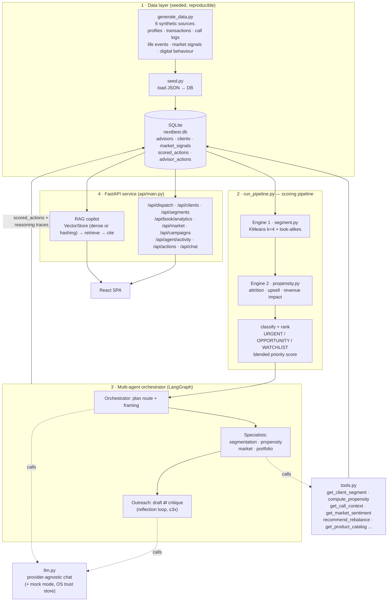
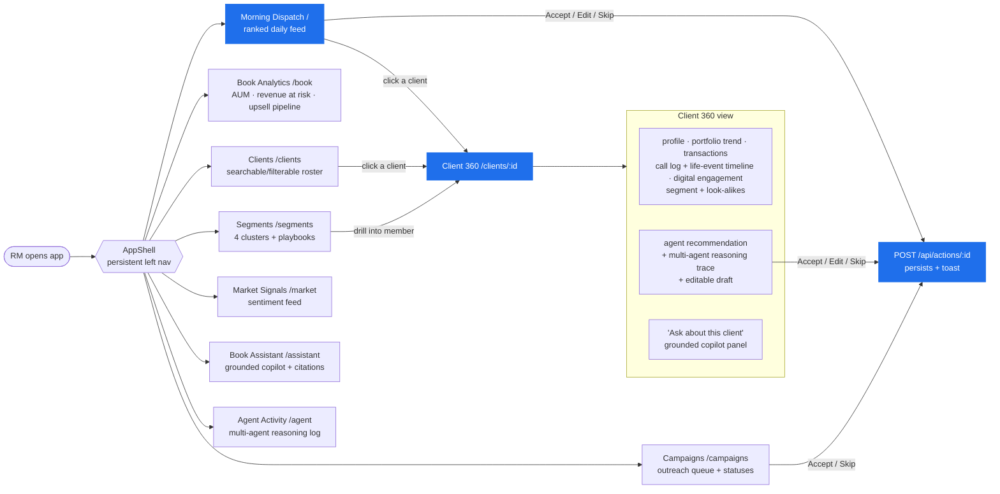
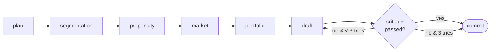

# NextBest

An AI **"next best action"** personalisation platform for bank/wealth relationship managers (RMs).
Built for the Apex Wealth *"Know Your Wealth"* brief: segment clients beyond AUM, predict attrition and
upsell, and give advisors a tool they'll actually use — a persistent, multi-page workspace driven by a
**multi-agent** system that shows its reasoning and closes the loop from insight to a ready-to-send draft.

> An RM carries 200–300 high-net-worth clients and can't proactively reach them all. Every morning
> NextBest tells the RM **who to contact, why, and what to open with** — a ranked daily dispatch, each
> item carrying a confidence score, a plain-language rationale, and an editable draft the RM can send,
> edit, or skip. A human is always in the loop.

**The differentiator:** most tools stop at insight on a dashboard; NextBest closes the loop to a
specific recommended action — and the *agent* is how that loop closes.

Architecture in one line:

```
Synthetic data (6 sources) → SQLite → engines (segmentation + propensity)
  → multi-agent orchestrator (plan → specialists → draft → critique) → FastAPI → React SPA
```

---

## Table of contents

- [What NextBest does](#what-nextbest-does)
- [Tech stack](#tech-stack)
- [Backend architecture](#backend-architecture)
- [Frontend UI flow](#frontend-ui-flow)
- [The multi-agent system](#the-multi-agent-system)
- [The pages (advisor suite)](#the-pages-advisor-suite)
- [Setup guide](#setup-guide)
- [Regenerating data / re-scoring](#regenerating-data--re-scoring)
- [Running the tests](#running-the-tests)
- [Verifying the agent is using the LLM](#verifying-the-agent-is-using-the-llm)
- [Troubleshooting](#troubleshooting)
- [Repo layout](#repo-layout)

---

## What NextBest does

1. **Segments the whole book beyond AUM** — behavioural KMeans clustering (engagement, flows, tenure,
   life events) puts every client into one of four segments with look-alike neighbours.
2. **Predicts attrition & upsell** — a transparent, rule-based propensity engine scores every client for
   churn risk, upsell readiness, and revenue impact, and lists exactly which rules fired.
3. **Reasons its way to an action** — a LangGraph multi-agent orchestrator consults specialist agents,
   grounds an outreach draft on the client's call history and market signals, and self-critiques it for
   compliance before committing.
4. **Closes the loop** — the RM sees a ranked morning feed and can **Accept / Edit / Skip** each draft;
   every action persists to the database.
5. **Answers questions about the book** — a retrieval-grounded copilot cites its sources from call notes,
   life events, market signals, and the agent's own rationale.

---

## Tech stack

| Layer | Technology |
|---|---|
| Agent core | Python 3.11+, **LangGraph** (multi-agent graph) |
| ML engines | **scikit-learn** (KMeans segmentation, nearest-neighbours look-alikes) |
| Schemas | **pydantic** (typed contracts shared across every stage) |
| Persistence | **SQLAlchemy** + **SQLite** (one local DB file) |
| LLM | Provider-agnostic wrapper (PwC GenAI Shared Service / OpenAI / Anthropic / any OpenAI-compatible gateway) with a deterministic **mock mode** |
| Retrieval (copilot) | Dense embeddings when a key is present, deterministic `HashingVectorizer` fallback otherwise |
| API | **FastAPI** + Uvicorn |
| Frontend | **React + Vite + TypeScript**, `react-router`, hand-built CSS + SVG charts (no component library) |

---

## Backend architecture

The backend is a linear, reproducible pipeline (deterministic engines) that feeds an agentic loop
(the LLM-driven orchestrator), with a FastAPI layer serving the React app from one SQLite database.



**Flow of control**

1. `seed.py` generates six synthetic data sources and loads ~300 clients across 3 advisors into SQLite.
2. `run_pipeline.py` loads the book, runs the two **deterministic engines** over *every* client, then
   classifies and ranks each one (`URGENT` / `OPPORTUNITY` / `WATCHLIST`) by a blended priority score.
3. For the top `TOP_N_DRAFT` clients it invokes the **LangGraph orchestrator**: an orchestrator plans a
   route, specialist agents append findings to a shared reasoning trace, and an outreach agent drafts and
   self-critiques a compliance-safe message. Results (draft, framing, trace, confidence) are written back
   to `scored_actions`.
4. **FastAPI** serves the scored book to the frontend and persists advisor Accept/Edit/Skip actions. A
   separate **RAG copilot** answers grounded questions over the same records.

---

## Frontend UI flow

A single-page React app (`react-router`) wrapped in a persistent `AppShell` (left nav + advisor
identity). Every page calls the typed API client (`src/api/client.ts`), which proxies `/api` to the
FastAPI backend. The primary demo journey is highlighted.



**The sub-60-second demo path (highlighted):** open **Morning Dispatch** → the most at-risk client is on
top → click into **Client 360** → read *why* she's flagged (the reasoning trace) and *what to say* (the
draft) → click **Accept** → the message is ready and the action persists.

---

## The multi-agent system

An **Orchestrator** agent reads each client's signals and decides which specialists to consult; each
specialist appends to a shared reasoning trace tagged with its own name, then an **Outreach** agent
drafts and self-critiques (reflection loop) before the recommendation is committed.

| Agent | Role |
|---|---|
| Orchestrator | Plans the route + framing (`re-engagement` / `opportunity` / `check-in`), synthesises the recommendation |
| Segmentation | Behavioural cluster (KMeans) + look-alike clients |
| Propensity / Risk | Attrition, upsell, revenue impact + engagement & net-flow trends |
| Market-Signal | Dated market sentiment vs the client's exposures |
| Portfolio-Nudge | Rebalance idea + eligible product from the catalog |
| Outreach | Draft → critique → regenerate (compliance-safe messaging) |

**The reflection loop & compliance guardrail.** The outreach draft must **never** mention scores, risk,
percentages, or internal metrics. The critique step scores the draft, and a deterministic regex
guardrail (`_METRIC_LEAK_PATTERNS`) catches any leaked number or term even if the LLM critique is
lenient — a failed check triggers a redraft (up to 3 attempts). This shows in the trace as an
`outreach · critique` step marked *failed*, followed by another `draft_message` step.



---

## The pages (advisor suite)

- **Morning Dispatch** — the ranked daily feed; Accept / Edit / Skip persist to the DB.
- **Book Analytics** — AUM, revenue at risk, upsell pipeline, segment mix, top movers.
- **Clients** — the full searchable/filterable book roster.
- **Client 360** — profile, portfolio trend, transactions, call-log + life-event timeline, digital
  engagement, segment + look-alikes, the agent's recommendation with its multi-agent trace, and an
  **"Ask about this client"** grounded copilot panel.
- **Segments** — the four behavioural clusters, characteristics, and playbooks.
- **Market Signals** — the sentiment feed the Market agent reasons over.
- **Campaigns** — the outreach queue with accept/skip statuses.
- **Book Assistant** — a retrieval-grounded copilot that answers questions about your book (call notes,
  life events, market signals, agent rationale) and cites every source; says so when records don't
  support an answer, and never drafts client-facing messages.
- **Agent Activity** — the full chronological multi-agent reasoning log.

---

## Setup guide

### Prerequisites

- **Python 3.11+**
- **Node.js 18+** and npm
- An LLM API key (optional — without one the agent runs in deterministic **mock mode**, enough to see the
  whole app). Supported: PwC GenAI Shared Service, OpenAI, Anthropic, or any OpenAI-compatible gateway.

### At a glance

```
Backend:   venv → pip install → (optional .env) → seed → run_pipeline → (optional rag.index) → uvicorn
Frontend:  npm install → npm run dev
```

### 1. Backend setup

Run everything from the **repository root** (the backend uses `backend.` package imports).

```powershell
# Windows (PowerShell)
python -m venv .venv
.\.venv\Scripts\Activate.ps1
pip install -r backend/requirements.txt
```

```bash
# macOS / Linux
python3 -m venv .venv
source .venv/bin/activate
pip install -r backend/requirements.txt
```

### 2. Configure the LLM (optional — create `backend/.env`)

```powershell
Copy-Item backend/.env.example backend/.env   # PowerShell
```

Pick one provider (see `.env.example` for the full set). Leave keys blank to use **mock mode**.
The `.env` file holds a live secret — it is git-ignored and must never be committed.

| Variable | Purpose |
|---|---|
| `LLM_PROVIDER` | `openai` or `anthropic` |
| `OPENAI_API_KEY` / `ANTHROPIC_API_KEY` | your key (blank ⇒ mock mode) |
| `OPENAI_BASE_URL` | point at the PwC GenAI proxy or any OpenAI-compatible gateway |
| `OPENAI_MODEL` | e.g. `azure.gpt-4o-mini` (drafts) |
| `OPENAI_EMBED_MODEL` | embeddings model for the Book Assistant index |

### 3. Seed the database, then run the pipeline

```powershell
python -m backend.seed          # generates synthetic data + builds nextbest.db
python -m backend.run_pipeline  # engines + multi-agent scoring -> writes to the DB
```

`seed` creates ~300 clients across 3 advisors with 6 data sources (profiles, transactions, call logs,
life events, market sentiment, digital behaviour). `run_pipeline` scores the whole book and runs the
multi-agent orchestrator for the top-priority clients. With a real key you'll see per-client drafting
and critiquing; the run takes a few minutes.

### 4. (Optional) Build the RAG index for the Book Assistant

```powershell
python -m backend.rag.index    # embeds the book -> data/rag_index.npz + .json
```

The **Book Assistant** copilot answers grounded questions about your book and cites its sources.
This step builds a dense embedding index and only runs when an OpenAI-compatible key is set. Without
a key (or without an embeddings model on the proxy) it no-ops with a message — the API then serves the
copilot via a deterministic scikit-learn `HashingVectorizer` fallback, so it always works. Re-run this
after regenerating data to refresh the index.

### 5. Start the API

```powershell
uvicorn backend.api.main:app --port 8000
```

### 6. Start the frontend (new terminal)

```powershell
cd frontend
npm install        # first time only
npm run dev
```

Open the URL it prints (default **http://localhost:5173/**). The dev server proxies `/api` to
`http://127.0.0.1:8000`, so both must be running.

---

## Regenerating data / re-scoring

```powershell
python -m backend.generate_data   # optional: regenerate the JSON (seeded, reproducible)
python -m backend.seed            # rebuild the DB from JSON (drops + recreates tables)
python -m backend.run_pipeline    # re-score + re-draft
python -m backend.rag.index       # refresh the Book Assistant index (only with a key)
```

## Running the tests

```powershell
python -m pytest backend/tests/ -v
```

Pure, deterministic checks on the segmentation and propensity engines (no LLM calls).

---

## Verifying the agent is using the LLM

Open the **Agent Activity** page or inspect a top client's trace on **Client 360**:

- **Mock** drafts are fixed sentences and identical every run.
- **Live** drafts are freshly worded and vary between runs.
- The **reflection loop** shows as an `outreach · critique` step marked "failed" followed by another
  `draft_message` step (the agent regenerating up to 3 times).

## Troubleshooting

- **`ModuleNotFoundError: No module named 'backend'`.** Run from the **repo root**, not inside `backend/`.
- **API page shows "Couldn't reach the agent service".** Start `uvicorn backend.api.main:app --port 8000`.
- **Empty feed / 404s.** You skipped a step — run `python -m backend.seed` then `python -m backend.run_pipeline`.
- **`CERTIFICATE_VERIFY_FAILED` on a corporate network.** Handled via `truststore` in `backend/llm.py`;
  just ensure `pip install -r backend/requirements.txt` ran (PwC endpoints also need the VPN).
- **Port already in use.** Vite will pick the next free port; for the API pass `--port 8001` and update
  the proxy target in `frontend/vite.config.ts`.

---

## Repo layout

```
nextbest/
├── backend/
│   ├── schemas.py          # pydantic contracts (NextBestAction, ReasoningStep, ...)
│   ├── config.py           # seed, sizes, DB path, RAG settings
│   ├── generate_data.py    # synthetic 6-source dataset (seeded)
│   ├── db.py               # SQLAlchemy models (SQLite)
│   ├── seed.py             # generate + load into the DB
│   ├── segment.py          # Engine 1 — KMeans behavioural segmentation
│   ├── propensity.py       # Engine 2 — attrition / upsell / revenue scoring
│   ├── tools.py            # agent tools (segment, propensity, market, rebalance, ...)
│   ├── llm.py              # provider-agnostic LLM client (+ mock mode, OS trust store)
│   ├── prompts.py          # orchestrator / draft / critique / RAG prompts
│   ├── agents/             # multi-agent core (orchestrator + specialists + state)
│   ├── rag/                # Book Assistant: corpus, vector store, index, chat
│   ├── run_pipeline.py     # engines + agents -> DB
│   ├── api/                # FastAPI service (main.py + serializers)
│   └── tests/              # deterministic engine tests
└── frontend/               # Vite + React + TS multi-page SPA
    └── src/{api,pages,layout,components,lib,styles}
```
